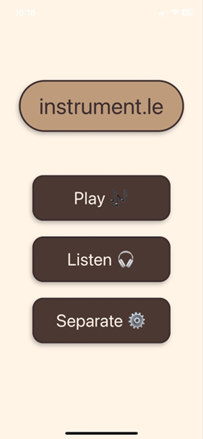
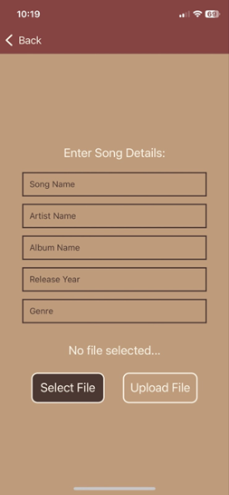
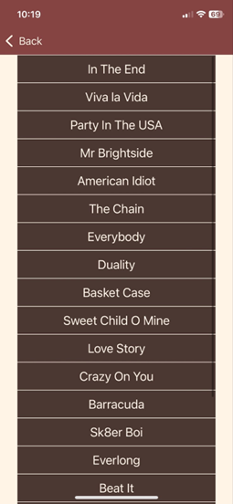
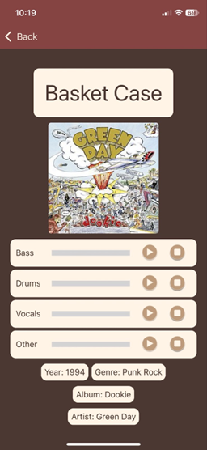
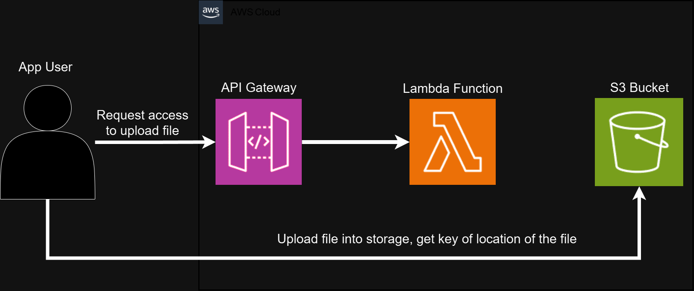
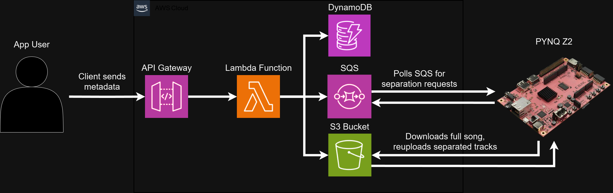
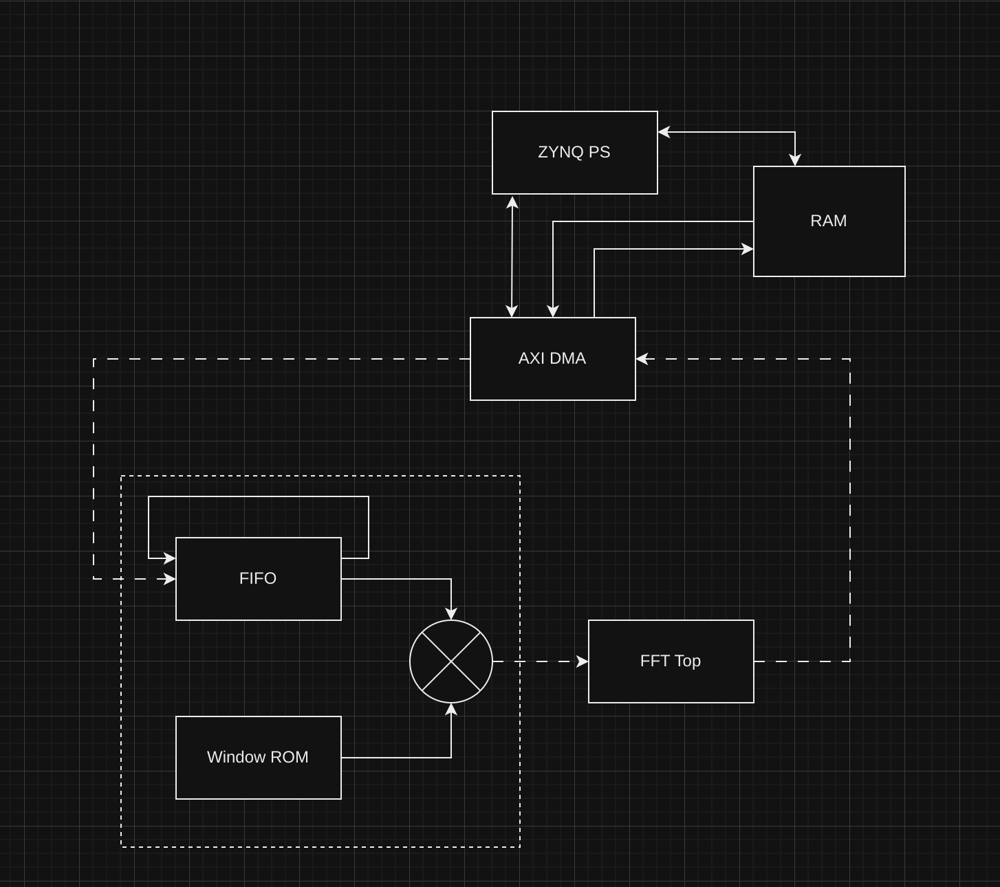
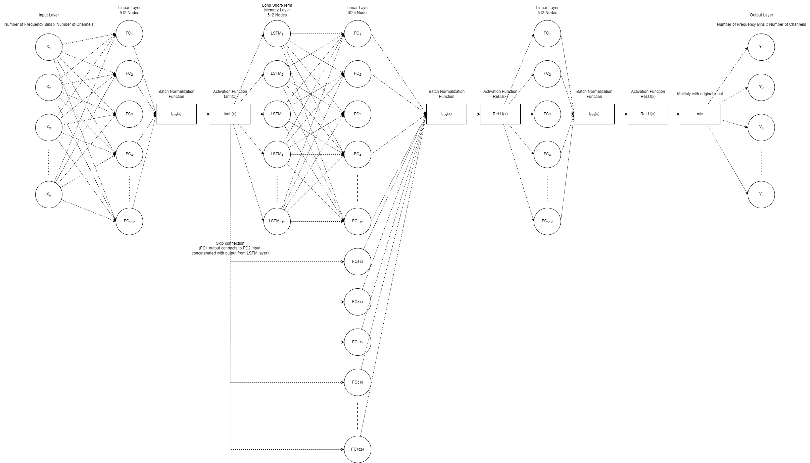

# instrument.le

## Overview
`instrument.le` is a project focused on audio signal processing and separation. The goal is to separate different instruments from a mixed audio track using machine learning models.

## Sections

### Mobile App
The mobile app is built using React Native. It serves as the user interface for interacting with the audio processing features of the project.

#### Screenshots

   

* The home screen provides quick access to the main features of the app.
* The upload screen allows the user to upload an mp3 file to be separated by the app. 
* The user can choose any previously uploaded or separated song.
* The user can play back the isolated instruments or vocals of their uploaded song.

---

#### Cloud Services Architecture (AWS)
The backend architecture runs on AWS and uses multiple services. (Refer to diagram below):




1. **API Gateway**
The API Gateway is used to handle incoming requests from the React Native clients. It forwards the requests to corresponding Lambda functions.

2. **Lambda**
Lambda handles requests from the API Gateway and sends data back to the client. If the user wants to upload a song, Lambda functions handle retrieving the presigned URLs for both uploading and downloading. Lambda also handles retrieval of song metadata from DynamoDb as well as inserting and updating records.

3. **S3**
S3 holds the raw .mp3 files that are uploaded by the user, as well as all the separated tracks uploaded by the separator service.

4. **DynamoDB**
DynamoDb holds the metadata for each song, including song title, artist, release year, genre, etc. Each song uploaded will have a corresponding row of metadata, and the S3 keys for each separated track is also held in DynamoDb for the client to retrieve for playback.

5. **SQS**
SQS is a queue service that manages which song is next to be separated. The DynamoDb index gets pushed into the SQS and the code running on the FPGA will retrieve this and then perform the associated FFTs and tensor packing on the audio files.

---

### FPGA
The FPGA development environment is set up to accelerate certain processing tasks. This involves configuring the environment and activating it for development.

The FPGA code in the `fpga` folder is designed to accelerate audio processing tasks by offloading computationally intensive operations such as Fast Fourier Transforms (FFTs) and tensor packing. This allows for faster and more efficient separation of audio signals into individual instruments.



The architecture of the FPGA implementation includes several key components:

1. **AXI Interfaces**: These interfaces handle communication between the FPGA and other system components, such as memory and processors.
2. **FFT Modules**: These modules perform the Fast Fourier Transform operations on the audio data, converting it from the time domain to the frequency domain.
3. **BRAM (Block RAM)**: This memory is used to store intermediate data and results during processing.
4. **Control Logic**: This logic manages the flow of data and coordinates the operations of the various modules within the FPGA.

The FPGA architecture is designed to handle high-throughput data processing, making it well-suited for real-time audio signal processing applications.

---

### LSTM Neural Network
The Long Short-Term Memory (LSTM) neural network used in this project is specifically designed for audio signal processing. The model is a bidirectional LSTM (BiLSTM), which means it processes the audio data in both forward and backward directions. This bidirectional approach allows the model to capture temporal dependencies in the audio signal more effectively.

#### Training
The LSTM model was trained on the SigSep dataset, which consists of various audio samples with different instruments and background noises. The training process involved optimizing the model to accurately separate different instruments from the mixed audio tracks. The model was trained using a sampling rate of 44.1kHz to ensure high-quality audio processing.

#### Functionality
The primary function of the LSTM neural network is to separate different sources from a mixed audio track. For example, it can isolate vocals from background music or separate different instruments in a song. The model takes the mixed audio as input and outputs the separated sources, which can then be further processed or analyzed.



The architecture of the LSTM model includes several key components:
1. **Input Layer**: Receives the mixed audio signal.
2. **LSTM Layers**: Processes the audio data in both forward and backward directions to capture temporal dependencies.
3. **Fully Connected Layers**: Maps the LSTM outputs to the desired separated sources.
4. **Output Layer**: Produces the separated audio sources.

This neural network architecture is highly effective for audio separation tasks, providing high-quality results even in challenging audio environments.

---

## Setup

### Prerequisites
- Python 3.10

### Installation

1. **Install Python 3.10**
    ```bash
    sudo apt-get install python3.10
    sudo apt-get install python3.10-venv
    ```

2. **Clone the Repository**
    ```bash
    git clone git@github.com:moorec25/instrument.le.git
    ```

3. **Setup Environment For FPGA Development**
    Add the following lines to your `.bashrc`:
    ```bash
    export CAPSTONE_HOME=#Path to repository
    alias activate="source $CAPSTONE_HOME/fpga/envsetup.sh"
    ```

4. **Activate Environment For FPGA Development**
    To setup the environment and install all dependencies, run:
    ```bash
    activate
    ```

5. **Setup Backend with Docker**
    Navigate to the `backend` directory
    ```bash
    cd backend
    ```

6. **Build the Docker Image**
    ```bash
    docker build -t backend-server .
    ```

7. **Run the Docker Container**
    ```bash
    docker run -p 3000:3000 backend-server
    ```

8. **Setup Frontend with React Native**
    Navigate to the `frontend` directory
    ```bash
    cd frontend
    ```

9. **Install Dependencies**
    Ensure you have `npm` installed, then run:
    ```bash
    npm install
    ```

10. **Run the React Native App**
    To start the React Native development server, run:
    ```bash
    npm start
    ```

11. **Upload Lambda Functions to AWS**
    Navigate to the `lambda` directory
    ```bash
    cd lambda
    ```

12. **Install AWS CLI**
    Ensure you have the AWS CLI installed. If not, install it using:
    ```bash
    pip install awscli
    ```

13. **Configure AWS CLI**
    Configure the AWS CLI with your credentials:
    ```bash
    aws configure
    ```

14. **Deploy Lambda Functions**
    Use the AWS CLI to deploy your Lambda functions:

    ```bash
    aws lambda create-function --function-name myLambdaFunction --runtime python3.10 --role arn:aws:iam::account-id:role/execution_role --handler lambda_function.lambda_handler --zip-file fileb://function.zip
    ```

    Replace `myLambdaFunction`, `account-id`, `execution_role`, and `function.zip` with your specific details.

15. **Update Lambda Functions**
    To update an existing Lambda function, use:
    ```bash
    aws lambda update-function-code --function-name myLambdaFunction --zip-file fileb://function.zip
    ```

    Replace `myLambdaFunction` and `function.zip` with your specific details.

    This will start the React Native development server and launch the app on your chosen platform.

    ## Additional AWS Setup

    The rest of the project requires additional AWS services such as API Gateway, DynamoDB, S3, SQS, and others. These services need to be set up in the AWS Management Console.

    1. **API Gateway**
        - Create a new API in the API Gateway console.
        - Define the necessary endpoints and integrate them with your Lambda functions.

    2. **DynamoDB**
        - Create a new DynamoDB table to store your application's data.
        - Configure the table's read and write capacity as needed.

    3. **SQS (Simple Queue Service)**
        - Create a new SQS queue to handle message queuing for your application.
        - Configure the queue settings according to your requirements.

    4. **Other Services**
        - Set up any additional AWS services required by your application, such as S3 for storage, CloudWatch for monitoring, etc.

    5. **S3 (Simple Storage Service)**
        - Create a new S3 bucket to store files and assets for your application.
        - Configure the bucket policies and permissions to control access.

    Ensure that all necessary IAM roles and permissions are configured to allow your services to interact with each other securely.

## License
This project is licensed under the MIT License.

## Contact
For any questions or concerns, please open an issue or contact the project maintainers.
